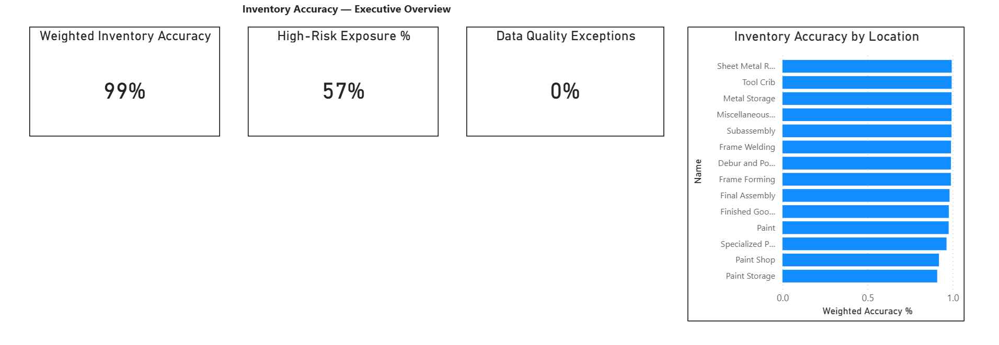

# AdventureWorks Inventory Accuracy & ICQA Analytics Portfolio

## Executive Summary
This repository showcases an enterprise-grade **Inventory Control & Quality Assurance (ICQA) analytics program** designed to simulate real-world warehouse and fulfillment center inventory accuracy workflows.

The program demonstrates how inventory metrics are **defined, validated, hardened, governed, and presented** across multiple analytical layers—mirroring how large-scale retail and e-commerce organizations operationalize trusted inventory data.

The focus is not on dashboards alone, but on **metric integrity, grain control, data quality enforcement, and decision-ready reporting**.

---

## Business Context
Accurate inventory is foundational to:
- Fulfillment reliability
- Demand planning accuracy
- Loss prevention
- Operational trust in reporting

ICQA teams require metrics that are:
- Reproducible across systems
- Transparent in calculation logic
- Resistant to data quality defects
- Actionable at both executive and operational levels

This portfolio simulates those requirements using the AdventureWorks dataset as a proxy for enterprise inventory data.

---

## Problem Statement
Operational teams face recurring challenges when:
- Inventory accuracy metrics differ between tools
- KPI logic changes silently due to aggregation errors
- Exceptions are hidden within averaged results
- Dashboards emphasize visuals over correctness

These issues create downstream risk in planning, fulfillment, and executive decision-making.

---

## Solution Overview
This program delivers a **phased, governed analytics solution**, progressing from raw data to decision-ready dashboards:

- **Excel** for early KPI validation and reconciliation
- **SQL Server** for hardened, reusable KPI logic
- **Data Quality checks** to enforce metric correctness
- **Power BI** for executive and operations reporting, built on a controlled semantic model

All deliverables are produced incrementally using **Agile-style sprints**, with explicit release notes and test evidence.

---

## ICQA Inventory Accuracy Analytics — Executive & Operations Program

This project represents the capstone of the program and integrates all prior phases into a production-style analytics solution.

### What makes this different
- SKU × Location grain enforced across all calculations
- KPI definitions remain consistent across Excel, SQL, and Power BI
- Data quality exceptions are explicitly surfaced, not hidden
- Separate **Executive** and **Operations** views aligned to real decision needs
- Semantic model isolates business logic from visuals

### Key KPIs
- Weighted Inventory Accuracy %
- High-Risk Exposure %
- Data Quality Exception Rate
- Location-level inventory accuracy
- SKU × Location exception detail for root-cause analysis

### Dashboard Previews
**Executive Overview**

**Operations Exception View**

📄 **PDF Export:**  
`module_4_powerbi_dashboard/Sprint_4_Test_Evidence/ICQA_Inventory_Dashboard_v2.pdf`

---

## Delivery Model & Sprint Structure
The program is delivered through structured sprints, each producing reviewable artifacts:

### Phase 0 — Setup & Standards
- Environment setup
- Naming conventions
- Repository structure

### Phase 1 — Excel ICQA Analytics
- Inventory reconciliation
- KPI prototyping
- Early variance analysis

### Phase 2 — SQL ICQA Core Model
- SKU × Location grain enforcement
- KPI calculation logic
- Aggregation hardening

### Phase 3 — Data Quality & Validation
- Exception detection
- Variance sanity checks
- High-risk flagging logic

### Phase 4 — Power BI Dashboards
- Executive overview dashboard
- Operations exception dashboard
- Governed semantic model
- Dedicated measures table

### Phase 5 — Portfolio Hardening & Executive Readout
- Finalized executive and operations dashboards
- Governed semantic model validation
- PDF exports for leadership distribution
- Test evidence and release documentation
- Analytics artifacts packaged for enterprise review

---

## Technology Stack
- **Microsoft SQL Server** (AdventureWorks OLTP & DW)
- **Microsoft Excel** (KPI validation & reconciliation)
- **Power BI Desktop** (Semantic model & dashboards)
- **GitHub** (Version control, sprint artifacts, documentation)

---

## Intended Audience
This portfolio is designed for:
- ICQA Data Analysts
- Business Intelligence Developers
- Data Analysts supporting Operations or Supply Chain
- Hiring managers seeking evidence of **analytics rigor**, not just visuals

---

## Repository Navigation
Each module folder contains:
- Sprint artifacts
- SQL scripts
- Documentation
- Test evidence
- Release notes

Start with:
- `module_2_sql_icqa_core_model`
- `module_3_data_quality_checks`
- `module_4_powerbi_dashboard`